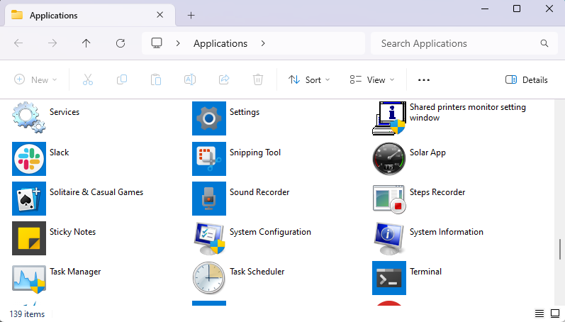

# Windows CommandLine App Launcher

New apps installed from the Microsoft Store are nearly impossible to easily launch from command line. The executables are hidden in some obscure package folder and managed by the app store. You are able to see a list of all the apps if you run `start shell:appsFolder`, however this is less than helpful for scripting or launching from command line.



This tool was written to easily launch Microsoft Apps from command line such as for launching apps in different virtual desktops using [vdesk](https://github.com/LittleVaaty/VDesk).


## Usage:

### List all Applications
`.\launch.ps1 -list`

```
 .\launch.ps1 -list
...
Google Chrome
Slack
Sticky Notes
Phone Link
Solitaire & Casual Games
...
```

### Launch Application

`.\launch.ps1 [application]`

```
.\launch.ps1 Slack

# multiword programs add quotes

.\launch.ps1 "Phone Link"
```

## Launch.bat Helper Script

launch.bat is included as a convenience wrapper script to set the ExecutionPolicy and run `launch.ps1`. It is useful if your system defaults to not run Powershell scripts.

`.\launch.bat -list`
```
 .\launch.bat -list
Windows PowerShell
Copyright (C) Microsoft Corporation. All rights reserved.

Install the latest PowerShell for new features and improvements! https://aka.ms/PSWindows

...
Google Chrome
Slack
Sticky Notes
Phone Link
Solitaire & Casual Games
...
```


## Possible future improvements:

`shell:appsFolder` include more than Microsoft Apps pulling apps from the start menu as well. Old apps will fail to launch with the launcher. We can either detect if it is not a Microsoft Store app and hide it from the `.\launch.ps1 -list` output or we can detect if a legacy application is passed and launch it properly. As of right now, old apps will not launch and output `The system cannot find the file specified.`


## References:

- https://learn.microsoft.com/en-us/powershell/module/startlayout/get-startapps?view=windowsserver2022-ps
- https://learn.microsoft.com/en-us/powershell/module/appx/get-appxpackage?view=windowsserver2022-ps
- https://superuser.com/questions/1543363/how-to-open-a-windows-store-app-from-command-line
- https://answers.microsoft.com/en-us/windows/forum/windows_10-windows_store/starting-windows-10-store-app-from-the-command/836354c5-b5af-4d6c-b414-80e40ed14675